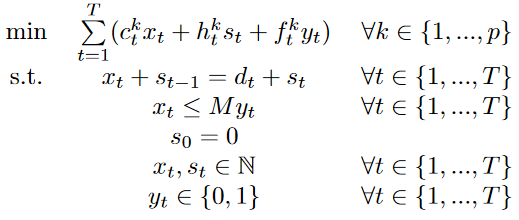

```{r setup, include=FALSE}
knitr::opts_chunk$set(echo = TRUE)
library(tidyverse)
```

## Preliminary tests

In this section, various configuration of the branch-and-bound are tested on each set of instances. The parameters of the algorithm are the followings:

  * node selection. This describes how the algorithm chooses the next node to explore. Two configurations are tested.
    + depth first (`depth`). The last node created is the first node explored.
    + breadth first (`breadth`). The first node created is the first node explored.
    
  * objective branching. This describes how sub-problems are created in the objective space, if any is created. The three configuration from [FORGET20] are tesed.
    + no objective branching (`noOB`). No sub-problems is created in the objective space.
    + cone objective branching (`coneOB`). A unique sub-problem is created, providing upper bounds on the objectives.
    + full objective branching (`fullOB`). As much disjoint sub-problems as possible are created.
   
  * lower bound set computation. This describes how the lower bound set is computed. Two configurations are tested.
    + linear relaxation (`LP`). The linear relaxation is computed from scratch at each node.
    + warmstarted linear relaxation (`WLP`). At a given node, the computation of the linear relaxation is warmstarted using the linear relaxation of its father node.
    
Other parameters :

  * variable index selection. This describes how the algorithm chooses the variable to split when performing branching on a node. Here, only one configuration is tested.
    + most often fractional. The variable that is the most often fractional among the extreme points of the lower bound set is chosen. In the binary case, if no variable is fractionnal, the one with the most variability (i.e. the most equally distributed between 0 and 1) is chosen. In the integer case, if no variable is fractional, the first free variable that has at least two different values is chosen. In all other cases, the first free variable is chosen. Same rule as in [FORGET20].
    
  * variable value selection. Given a branching variable $x_i$, this describes how the algorithm chooses the value to branch on. This parameter is relevant only for problems with integer variables, as one can only branch on 0 and 1 in the binary case.
    + median value. The median value of $x_i$ among the extreme points is chosen.


```{r cars, echo=FALSE}
#dat <- read.csv("results.csv")
datPrelim <- read.csv("resultsPrelim.csv")

#dat <- dat %>%
#  mutate(pb = strsplit( strsplit(instance, "_")[[1]][1] , "-" )[[1]][2])

datPrelim <- datPrelim %>%
  group_by(instance, configLB, configNodeSel, configOB) %>%
  mutate(pb = strsplit( strsplit(instance, "_")[[1]][1] , "-" )[[1]][2])

datPrelim <- datPrelim %>%
  group_by(instance, configLB, configNodeSel, configOB) %>%
  mutate(cpuTotal = min(cpuTotal,600))
```

### Integer Linear Programs (Kirlik and Sayin, 2014)

This set of instances is extracted from [Kirlik and Sayin (2014)](http://home.ku.edu.tr/~moolibrary/). It consists of randomly generated multi-objective integer linear programs.

There is a plot for lower bound set configuration (LP, WLP) and number of objectives (3, 4, 5).

```{r, echo = FALSE}
datPrelim %>%
  filter(pb == "ILP") %>%
  group_by(p, configLB, configOB, configNodeSel) %>%
  arrange(cpuTotal) %>%
  mutate(count = row_number()) %>%
    ggplot() +
    geom_step(aes(x = cpuTotal, y = count, color = configOB, linetype = configNodeSel)) +
    facet_grid(vars(p), vars(configLB), scales = "free") +
    xlab("CPU time (in seconds)") + ylab("number of instances solved")


```

### Uncapatitated Facility Location Problem (Forget et. al., 2020)

This set of instances is extracted from [Forget et. al. (2020)](https://github.com/MCDMSociety/MOrepo-Forget20) . Instances for 4 and 5 objectives are generated by following the same rules of generation.

There is a plot for lower bound set configuration (LP, WLP) and number of objectives (3, 4, 5).

```{r, echo = FALSE}
datPrelim %>%
  filter(pb == "UFLP") %>%
  group_by(p, configLB, configOB, configNodeSel) %>%
  arrange(cpuTotal) %>%
  mutate(count = row_number()) %>%
    ggplot() +
    geom_step(aes(x = cpuTotal, y = count, color = configOB, linetype = configNodeSel)) +
    facet_grid(vars(p), vars(configLB), scales = "free") +
    xlab("CPU time (in seconds)") + ylab("number of instances solved")


```

### Production Planning Problem

This set of instances correspond to production planning problem. It has the following form:

{width=35%}

where $c_t^k \in [1,100]$, $h_t^k \in [1,100]$, $f_t^k \in [1,2500]$, $d_t \in [1,50]$, and $M = \sum\limits_{t=1}^T d_t$.

There is a plot for lower bound set configuration (LP, WLP) and number of objectives (3, 4, 5).

```{r, echo = FALSE}
inter <- datPrelim %>%
  filter(pb == "PPP") %>%
  group_by(p, configLB, configOB, configNodeSel) %>%
  arrange(cpuTotal) %>%
  mutate(cr = row_number()) #%>%
#    ggplot() +
#    geom_step(aes(x = cpuTotal, y = cr, color = configOB, linetype = configNodeSel)) +
#    facet_grid(vars(p), vars(configLB), scales = "free")

inter %>%
  ggplot() +
  geom_step(aes(cpuTotal, cr, color=configOB, linetype=configNodeSel)) +
  facet_grid(vars(p), vars(configLB), scales = "free") +
    xlab("CPU time (in seconds)") + ylab("number of instances solved")

```


## How beneficial is it to warmstart the computation of the lower bound set?

Given a fixed number of objectives, how does warmstarting the LB set performs compared to computing the LP relax from scratch at each iteration? There is a plot for each problem (ILP, PPP, UFLP) and number of objectives (3, 4, 5).

```{r pressure, echo=FALSE}
# from prelim 

tst <- datPrelim %>% # tst is best config only LP and WLP for prelim expe
  group_by(instance, configLB) %>%
  mutate(cpu = min(cpuTotal)) %>%
  filter(cpu == cpuTotal) %>%
  mutate(cpt = row_number()) %>%
  filter(cpt == 1)
  
tst %>%
  group_by(pb, p, configLB) %>%
  arrange(cpuTotal) %>%
  mutate(count = row_number()) %>% 
    ggplot() +
    geom_step( aes(x = cpuTotal, y = count,color = configLB, linetype = configLB) ) +
    facet_wrap(vars(pb, p), scales = "free") +
    xlab("CPU time (in seconds)") + ylab("number of instances solved")
    #facet_grid(vars(pb), vars(p), scales = "free")
  
# from main expe

#dat %>%
#  group_by(pb, p, configLB) %>%
#  arrange(cpuTotal) %>%
#  mutate(count = row_number()) %>%
#    ggplot() +
#    geom_step( aes(x = cpuTotal, y = count, linetype = configLB) ) +
#    facet_grid(vars(pb), vars(p), scales = "free")
```


```{r, echo=FALSE}
#What is the average speedup in function of the number of variables and the number of objective for each problem class?
#jcp <- tst %>%
#  filter(solved == 1) %>%
#  group_by(instance) %>%
#  mutate(speedup = max(cpuTotal) / min(cpuTotal)) %>%
#  filter(speedup != 1) %>%
#  filter(configLB == "WLP")

#jcp %>%
#  group_by(pb, n, p) %>%
#  summarise(avgSpeedUp = mean(speedup)) %>%
#    ggplot() +
#    geom_line(aes(n, avgSpeedUp, color=factor(p))) +
#    facet_wrap(vars(pb), scales = "free")
```


```{r, echo=FALSE}

# How can we explain this results? First, let's have a look at where most of the cpu time is used during the algorithm.

#res <- dat %>% 
#  filter(solved == 1) %>%
#  mutate(pctLB = 100 * cpuLbComputation / cpuTotal , pctUB = 100 * cpuUbUpdate / cpuTotal , pctDomiTest = 100 * cpuDominanceTest / cpuTotal , pctNodeSel = 100 * cpuNodeSel / cpuTotal , pctVarSel = 100 * cpuVarSel / cpuTotal , pctOther = 100 - pctLB - pctUB - pctDomiTest - pctNodeSel - pctVarSel) %>%
#  group_by(p, n, configLB) %>% 
#  summarise(avgLB = mean(pctLB) , avgUB = mean(pctUB) , avgDomiTest = mean(pctDomiTest) , avgNodeSel = mean(pctNodeSel) , avgVarSel = mean(pctVarSel) , avgOther = mean(pctOther)) %>%
#  pivot_longer(!c(p,n,configLB) , names_to = "part" , values_to = "pctCpu" ) #%>%


#ggplot(res, aes(x = factor(configLB), y = pctCpu, fill = part)) +
#  geom_col(color = "black") +
#  geom_text(aes(label = round(pctCpu, 2)), colour="white", size=2.5,
#              position = position_stack(vjust = .5)) +
#  facet_grid( rows = vars(n) , cols = vars(p), margins = F, scales = "free") +
#  ylab("% of total cpu time") + xlab("n")

```


```{r, echo=FALSE}

#res <- dat %>% 
#  filter(solved == 1) %>%
#  mutate(pctCplex = 100 * cpuCplex / cpuLbComputation , pctUpdatePolyhedron = 100 * cpuUpdatePolyhedron / cpuLbComputation , pctInitialization = 100 * cpuInitialization / cpuLbComputation, pctOther = 100 - pctCplex - pctUpdatePolyhedron - pctInitialization) %>%
#  group_by(p, n, configLB) %>% 
#  summarise(avgCplex = mean(pctCplex) , avgUpdatePolyhedron = mean(pctUpdatePolyhedron) , avgInitialization = mean(pctInitialization) , avgOther = mean(pctOther)) %>%
#  pivot_longer(!c(p,n,configLB) , names_to = "part" , values_to = "pctCpu" ) #%>%

#ggplot(res, aes(x = factor(configLB), y = pctCpu, fill = part)) +
#  geom_col(color = "black") +
#  geom_text(aes(label = round(pctCpu, 2)), colour="white", size=2.5,
#              position = position_stack(vjust = .5)) +
#  facet_grid( rows = vars(n) , cols = vars(p), margins = F, scales = "free") +
#  ylab("% of total LB computation time") + xlab("n")
 #ggplot(res, aes(x = factor(n), y = pct, fill = OB, linetype = nodeselVarsel)) + 
#  geom_col(color = "black") + 
#  geom_text(aes(label = round(pct, 2)), colour="white", size=2.5,
#              position = position_stack(vjust = .5)) +
#  scale_fill_ob + scale_linetype_nodesel_varsel +
#  facet_grid(cols = vars(pb), margins = F, scales = "free") +
#  ylab("% of instances") + xlab("n") +
#  theme_publish()
```

How many calls to Cplex are performed in average? There is a plot for each problem (ILP, PPP, UFLP) and number of objectives (3, 4, 5).

Note : only instances with at least one solved configuration both in LP and WLP are kept. Hence the number of calls to the LP solver may appear lower than it is in reality for the hardest instances.

```{r, echo=FALSE}

# prelim expe

intr <- tst %>%
  group_by(instance) %>%
  mutate(allSolved = min(solved)) %>%
  filter(allSolved == 1)

intr %>%
  group_by(pb,p,n,configLB) %>%
  summarise(avgLpSolved = mean(nbLpSolved)) %>%
  ggplot() +
  geom_line( aes(n,avgLpSolved,color=configLB,linetype = configLB) ) +
  facet_wrap(vars(pb,p), scales = "free") +
    xlab("number of variables (n)") + ylab("number of calls to the single-objective LP solver")

# main expe

#dat %>%
#  filter(solved == 1) %>%
#  group_by(pb,p,n,configLB) %>%
#  summarise(avgLpSolved = mean(nbLpSolved)) %>%
#  ggplot() +
#  geom_line( aes(n,avgLpSolved,linetype = configLB) ) +
#  facet_grid(vars(pb), vars(p), scales = "free")
```


# Others

Number of non-dominated points. There is a plot for each problem (ILP, PPP, UFLP) and number of objectives (3, 4, 5).
Note : only instances with at least one congiguration solved is kept. Hence the number of non-dominated points may appear lower than it is in reality for the hardest instances.


```{r, echo=FALSE}

datPrelim %>%
  filter(solved == 1) %>%
  group_by(instance) %>%
  mutate(mini = min(cpuTotal)) %>%
  filter(mini == cpuTotal) %>%
    ggplot() +
    geom_boxplot(aes(factor(n),YN, group = factor(n))) +
    facet_wrap(vars(pb,p), scales = "free") +
    xlab("number of variables (n)") + ylab("|YN|")

#res <- dat %>%
#  filter(solved == 1) %>%
#  group_by(p,n) %>%
#  summarise(avgYn = mean(YN))
  
#res %>% ggplot() +
#  geom_point( data = dat, aes(n,YN,col = factor(p)) ) +
#    geom_line( aes(n,avgYn,col = factor(p)) )
```

